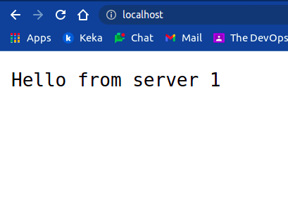
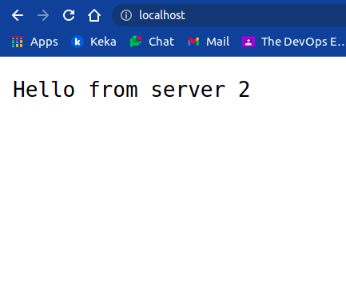
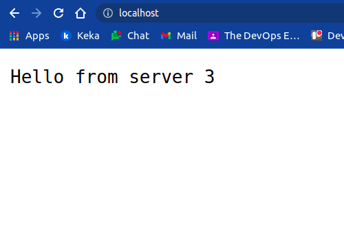
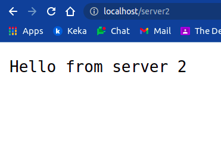
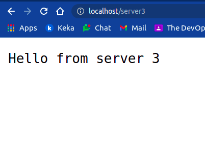

# nodejs-loadbalancer

Implementing load balancer using nginx

Steps

1. Delete or move `defualt` file in `/etc/nginx/sites_enabled`

```bash
cd /etc/nginx/sites_enabled
sudo rm default
```


2. create a `.conf` file in `/etc/nginx/conf.d/`
   
   > load-balancer.conf
```text
  upstream nodejs {
        server localhost:5001;
        server localhost:5002;
        server localhost:5003;
    }

    server {
        listen 80;
        server_name localhost;
        location / {
            proxy_pass http://nodejs;
        }
        location /server1 {
            proxy_pass http://127.0.0.1:5001;
        }
        location /server2 {
            proxy_pass http://127.0.0.1:5002;
        }
        location /server3 {
            proxy_pass http://127.0.0.1:5003;
        }
    }

```

3. Restart nginx server
```bash
systemctl restart nginx.service
```

4. Run node apps
```bash
node server1.js
node server2.js
node server3.js
```
---

## Demo

Hit url `localhost` and refresh page to see how it balancing in round robin fashion.



Refresh 



Refresh 



---

**Reverse Proxy** 

Hit `localhost/server[1-3]` and see how it takes you to the corresponding ports `5001 - 5003`






